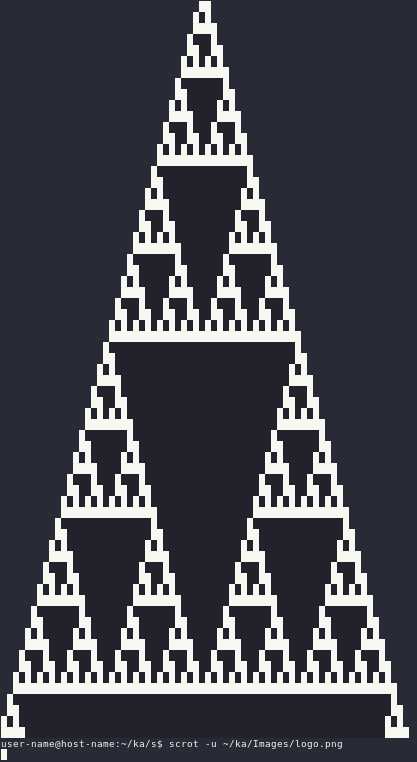

# AnsiSierpinski

AnsiSierpinski is a Simple Unix terminal [sierpinski triangle](https://en.wikipedia.org/wiki/Sierpi%C5%84ski_triangle) viewer written in Python that utilizes ansi escape sequences to render the sierpinski triangle into the terminal.

## Requirements

- Unix like system
- Python >= 3.9
- Support to ansi escape sequences and [1bit color](https://en.wikipedia.org/wiki/Color_depth)

## Arguments
- `-h, 	--help        → show this help message and exit`
- `-v, 	--version     → show program's version number and exit`
- `-r, 	--rows        → rows of sierpinski triangle`
- `-f, 	--fill        → sierpinski triangle size the same as terminal screen`
- `-sn, --shownum     → sierpinski triangle without graphics`

## Made by [Sivefunc](https://gitlab.com/sivefunc)
## Licensed under [GPLv3](LICENSE)
